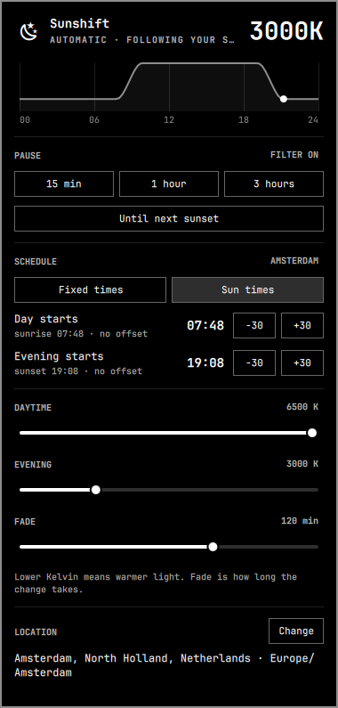

# Sunshift

A night light on a schedule for [Omarchy](https://omarchy.org). Sunshift warms your screen in the evening
and cools it again in the morning, following either fixed times or the real sunrise and sunset at your
location. It lives in the Omarchy bar as a small icon with a panel underneath, in the look of Omarchy's
own panels.

<p align="center"></p>

## What it does

- **Fixed times or sun times.** Pick "Day starts" / "Evening starts" yourself, or let Sunshift follow
  sunrise and sunset, with optional offsets in 30-minute steps.
- **Smooth transitions.** The color temperature fades over a period you choose (5 to 180 minutes)
  instead of switching at once.
- **Pause when you need true colors.** Pause for 15 minutes, an hour or three hours, until the next
  sunset, or until tomorrow's sunset. A running pause can be extended by 5 minutes or an hour.
- **Today at a glance.** The panel draws today's temperature curve and marks the current time.
- **Location without tracking.** On first start Sunshift suggests the main city of your time zone,
  worked out on your computer. You can search for a city, district or postal code instead, or turn on
  Wi-Fi location (off by default). See [Privacy](#privacy).
- **Takes over Omarchy's night light.** `Super + Ctrl + N` and the menu's night-light entry pause and
  resume Sunshift, and Quattro's own night-light indicator is hidden so the two don't fight.
- **Runs offline.** Sunrise and sunset are calculated on your computer for two years ahead.

## Requirements

- Omarchy with the Quattro shell (the bar Sunshift plugs into)
- `hyprsunset` and `python3` (both part of Omarchy)
- NetworkManager, only for the optional Wi-Fi location (Omarchy's default)

## Install

```bash
git clone https://github.com/passport0819/sunshift.git
cd sunshift
./install.sh
```

Run it from your Omarchy desktop session. Then click the new icon next to the tray to choose your
location and schedule. Running `./install.sh` again updates Sunshift and keeps your settings.

What the installer does:

| Where | What |
|---|---|
| `~/.local/share/sunshift/`, `~/.local/bin/sunshift` | The program |
| `~/.config/systemd/user/sunshift.service` | The background service, started now and at every login |
| `~/.config/systemd/user/hyprsunset.service.d/sunshift.conf` | hyprsunset starts neutral; Sunshift sets the temperature |
| `~/.config/hypr/hyprsunset.conf` | Replaced by a note, so hyprsunset's own schedule doesn't fight Sunshift |
| `~/.config/omarchy/plugins/sunshift.panel/` | The bar icon and panel, enabled with `omarchy plugin enable` |
| Bar settings | Quattro's night-light indicator is hidden (`omarchy bar set`) |
| `~/.config/hypr/sunshift.lua` + one line in `hyprland.lua` | `Super + Ctrl + N` pauses and resumes Sunshift |
| `~/.config/omarchy/extensions/omarchy-menu.jsonc` | The menu's night-light entry pauses and resumes Sunshift |

Every file it changes is saved first in `~/.local/state/sunshift/install-backup/`.

## Uninstall

```bash
./uninstall.sh
```

This stops Sunshift, removes it from the bar, gives `Super + Ctrl + N` and the menu entry back to
Omarchy, brings back the night-light indicator and restores the saved files. Your Sunshift settings stay
in `~/.config/sunshift/` for a later install; `./uninstall.sh --purge` removes them too.

## Using it

Click the icon in the bar to open the panel. The icon shows the time of day: sun, sunset, moon or
sunrise, and a pause sign while paused. Right-click the icon to pause or resume.

From a terminal or a key binding:

```bash
sunshift                  # open the panel
sunshift toggle           # pause for an hour, or resume
sunshift pause --minutes 30
sunshift pause --minutes 0   # until you resume
sunshift resume
sunshift evening          # pause until the next sunset
sunshift tomorrow         # pause until tomorrow's sunset
sunshift extend --minutes 5
sunshift status           # current temperature and pause state as JSON
```

Settings live in `~/.config/sunshift/config.json`; the panel is the easiest way to change them.

## Privacy

Out of the box Sunshift sends nothing anywhere. The suggested location comes from your time zone and the
time-zone table on your computer. Sunrise and sunset are calculated locally.

Network access happens only when you ask for it:

- **Location search** sends the text you type to
  [OpenStreetMap Nominatim](https://nominatim.org) and [Open-Meteo](https://open-meteo.com)'s geocoding
  service. Results are cached for 30 days, as Nominatim's usage policy asks. For a result in a country
  with several time zones (for example the USA), the coordinates of that result also go to Open-Meteo to
  find its time zone.
- **Wi-Fi location** (off by default) sends the hardware addresses and signal strengths of nearby Wi-Fi
  access points to [BeaconDB](https://beacondb.net), at login and every 12 hours while it is on. Network
  names are not sent, networks whose name ends in `_nomap` are skipped, and your IP address is not used
  to guess the location. The result is stored rounded to about 1 km. Choosing a city in the search turns
  Wi-Fi location off.

Like any web request, these services see your IP address. Their own privacy policies apply.

## Credits and license

Sunshift is released under the [MIT License](LICENSE).

It includes [Astral](https://github.com/sffjunkie/astral) 3.2 by Simon Kennedy for the sun calculations,
licensed under the Apache License 2.0 (`share/vendor/astral-3.2.dist-info/LICENSE`).
Place search data © [OpenStreetMap](https://www.openstreetmap.org/copyright) contributors.
Wi-Fi location by [BeaconDB](https://beacondb.net). Geocoding and time zones by
[Open-Meteo](https://open-meteo.com).
